# Named Entity Recognition — Multi-Embedding & Multi-Tokenizer Pipeline

> A systematic comparison of **5 word embeddings × 3 tokenizers** using a **BiLSTM-CRF** architecture on the **BC5CDR** biomedical NER dataset.

---

## Table of Contents

- [Overview](#overview)
- [Architecture](#architecture)
- [Dataset](#dataset)
- [Embeddings & Tokenizers](#embeddings--tokenizers)
- [Results Summary](#results-summary)
- [Training Curves](#training-curves)
  - [ELMo](#elmo)
  - [BERT](#bert)
  - [GloVe](#glove)
  - [FastText](#fasttext)
  - [Word2Vec](#word2vec)
- [Comparison Charts](#comparison-charts)
- [Key Findings](#key-findings)
- [Setup & Installation](#setup--installation)
- [Project Structure](#project-structure)

---

## Overview

This project benchmarks different combinations of **word embedding models** and **tokenization strategies** for Named Entity Recognition (NER) on biomedical text. Each pipeline is trained end-to-end using a BiLSTM-CRF model, evaluated on token accuracy and entity-level F1 score.

**Total experiments:** 15 pipelines (5 embeddings × 3 tokenizers)  
**Best result:** ELMo + BPE_WP — **Test F1: 0.7921 | Test Acc: 98.22%**

---

## Architecture

```
Input Tokens
     ↓
Word Embeddings (ELMo / BERT / GloVe / FastText / Word2Vec)
     ↓
BiLSTM (hidden_dim=256, dropout=0.3)
  → Forward LSTM  →→→→→→→→→
  ← Backward LSTM ←←←←←←←←
     ↓
CRF Decoder
     ↓
NER Tag Sequence (B-Chemical, B-Disease, O)
```

| Hyperparameter | Value |
|---|---|
| Hidden Dimension | 256 |
| Dropout | 0.3 |
| Optimizer | Adam |
| Learning Rate | 1e-3 |
| Batch Size | 32 |
| Epochs | 20 (ELMo/GloVe/FastText/Word2Vec) · 8 (BERT) |

---

## Dataset

**BC5CDR** — BioCreative V Chemical-Disease Relation corpus. A widely-used biomedical NER benchmark with annotations for chemicals and diseases in PubMed abstracts.

| Split | Sentences |
|---|---|
| Train | ~4,560 |
| Validation | ~4,581 |
| Test | ~4,797 |

**Tag scheme:** BIO — `B-Chemical`, `B-Disease`, `O`

---

## Embeddings & Tokenizers

### Embeddings

| Embedding | Dim | Type | Key Feature |
|---|---|---|---|
| **ELMo** | 1024 | Contextual | Bidirectional language model; context-sensitive |
| **BERT** | 768 | Contextual (Transformer) | Attention-based; subword-aware |
| **GloVe** | 300 | Static | Global co-occurrence statistics |
| **FastText** | 300 | Static | Subword character n-grams |
| **Word2Vec** | 300 | Static | Predictive; local context window |

### Tokenizers

| Tokenizer | Description |
|---|---|
| **BPE_WP** | Byte-Pair Encoding / WordPiece (Hugging Face) |
| **NLTK** | Rule-based word tokenizer |
| **Whitespace** | Simple whitespace splitting |

---

## Results Summary

Full pipeline results ranked by Test F1 score:

| Embedding | Tokenizer | Val F1 | Test F1 | Val Acc | Test Acc |
|---|---|---|---|---|---|
| **ELMo** | **BPE_WP** | **0.7972** | **0.7921** | **0.9818** | **0.9822** |
| ELMo | NLTK | 0.7896 | 0.7878 | 0.9781 | 0.9790 |
| BERT | BPE_WP | 0.8072 | 0.7865 | 0.9804 | 0.9799 |
| BERT | NLTK | 0.8050 | 0.7860 | 0.9806 | 0.9804 |
| ELMo | Whitespace | 0.7868 | 0.7836 | 0.9782 | 0.9789 |
| BERT | Whitespace | 0.7969 | 0.7805 | 0.9800 | 0.9789 |
| GloVe | BPE_WP | 0.7830 | 0.7708 | 0.9812 | 0.9813 |
| GloVe | NLTK | 0.7534 | 0.7349 | 0.9753 | 0.9753 |
| GloVe | Whitespace | 0.7521 | 0.7317 | 0.9762 | 0.9759 |
| FastText | BPE_WP | 0.7296 | 0.7160 | 0.9769 | 0.9765 |
| Word2Vec | BPE_WP | 0.7179 | 0.7051 | 0.9764 | 0.9762 |
| Word2Vec | NLTK | 0.7144 | 0.6992 | 0.9734 | 0.9729 |
| Word2Vec | Whitespace | 0.7083 | 0.6969 | 0.9729 | 0.9728 |
| FastText | Whitespace | 0.7110 | 0.6904 | 0.9717 | 0.9702 |
| FastText | NLTK | 0.7047 | 0.6873 | 0.9697 | 0.9697 |

> 🏆 **Best pipeline: ELMo + BPE_WP — Test F1: 0.7921**


---

## Training Curves

Each plot shows token accuracy (train / val / test) and CRF training loss over epochs.

---

### ELMo

#### ELMo + BPE_WP
Train accuracy converges to ~99.9%. Val/Test accuracy stabilise around 98.2%. CRF loss drops smoothly from ~4.8 to near 0 over 20 epochs.

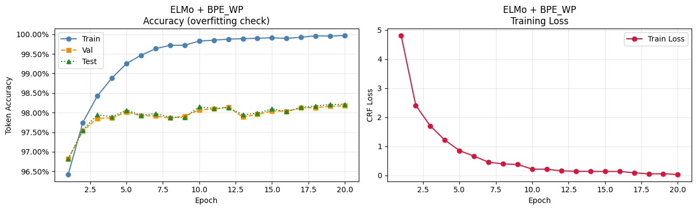

---

#### ELMo + NLTK
Similar convergence pattern to BPE_WP. Val/Test accuracy plateaus around 97.8%. Slight train-val gap indicates mild overfitting.

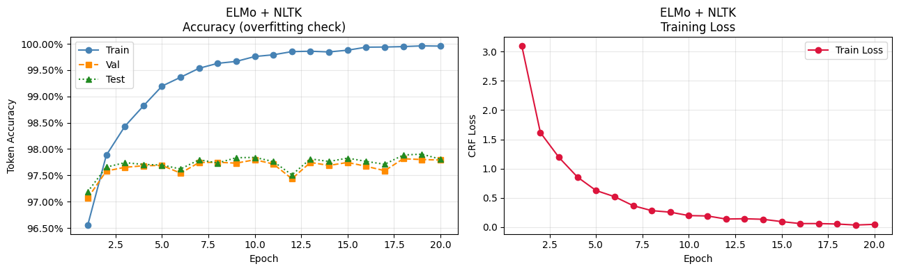

---

#### ELMo + Whitespace
Val/Test accuracy stabilises around 97.8%. Loss curve follows smooth exponential decay. Comparable to NLTK performance.

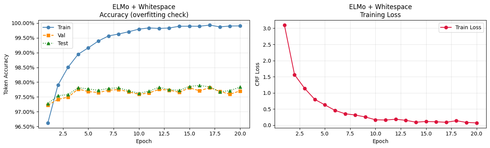

---

### BERT

#### BERT + BPE_WP
Fast convergence within 8 epochs. Train accuracy reaches ~99.9%; Val/Test stabilise ~98%. CRF loss decays sharply from ~4.5 to near 0.

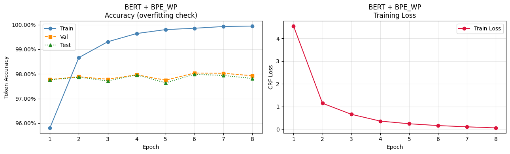

---

#### BERT + NLTK
Highest Val F1 across all experiments (0.8072). Strong and stable generalisation. Loss curve nearly identical to BPE_WP variant.

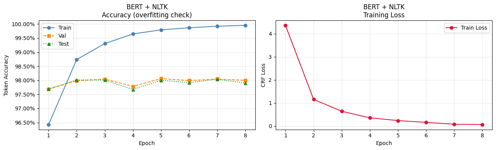

---

#### BERT + Whitespace
Slightly lower test accuracy than NLTK/BPE_WP variants. Some oscillation in val/test curves after epoch 4. Loss reduction remains steep.

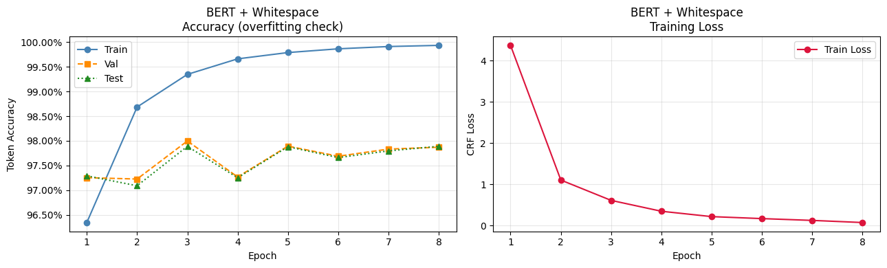

---

### GloVe

#### GloVe + BPE_WP
Smooth convergence over 20 epochs. Val/Test settle around 98.1%. Loss starts higher (~6.3) but decays cleanly.

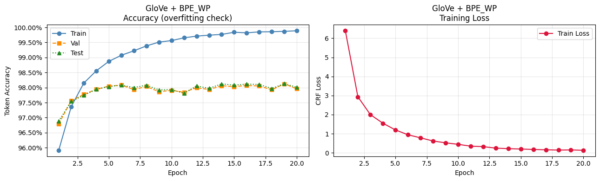

---

#### GloVe + NLTK
More volatile val/test curves compared to BPE_WP. Accuracy plateaus around 97.5%. Loss decay is normal.

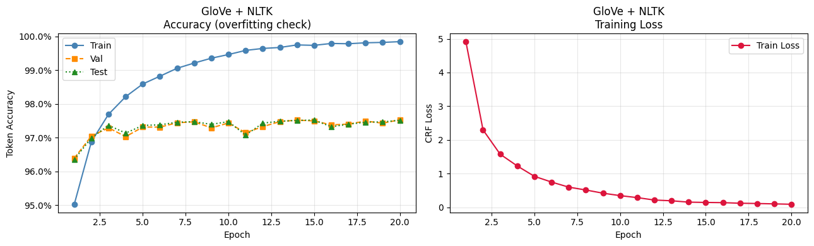

---

#### GloVe + Whitespace
Similar pattern to NLTK. Slight instability in later epochs. Val/Test hover around 97.5%.

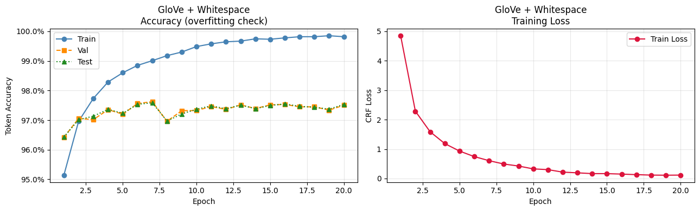

---

### FastText

#### FastText + BPE_WP
High initial CRF loss (~7.3). Gradual convergence over 20 epochs. Val/Test around 97.2% with some oscillation.

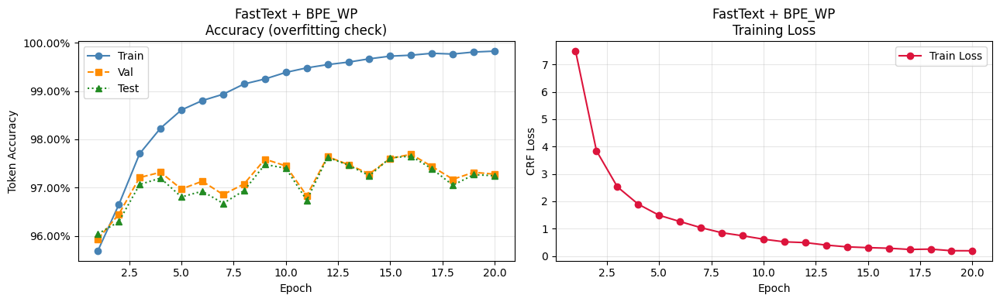

---

#### FastText + NLTK
Most volatile val/test curves among all experiments. Accuracy between 96–97%. Loss decays well but generalisation is inconsistent.

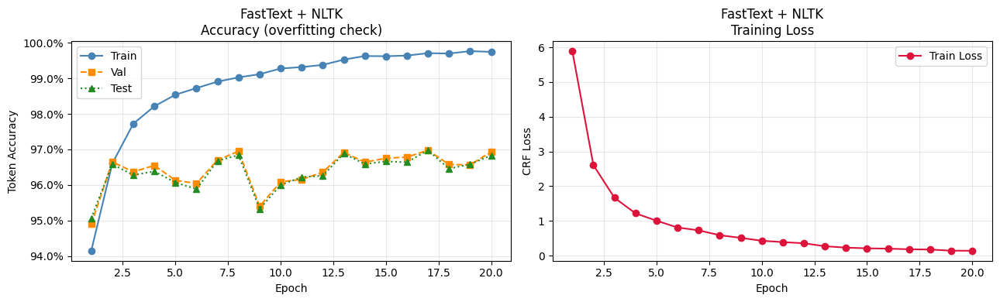

---

#### FastText + Whitespace
Similar instability to NLTK variant. Lowest test accuracy among FastText pipelines (97.02%).

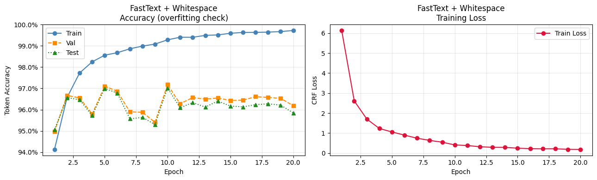

---

### Word2Vec

#### Word2Vec + BPE_WP
Val/Test accuracy around 97.3%. High initial loss (~7.3) with smooth decay. Moderate generalisation gap.

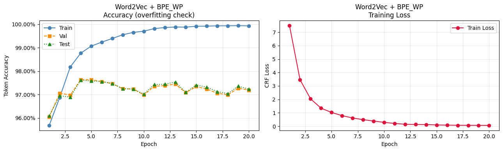

---

#### Word2Vec + NLTK
Notable oscillation in val/test accuracy. Some spikes and dips between epochs 8–16. Lowest stability among Word2Vec variants.

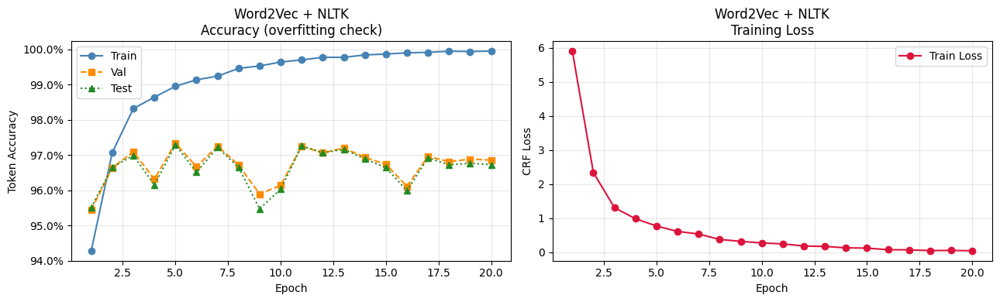

---

#### Word2Vec + Whitespace
Comparable oscillation to NLTK variant. Val/Test hover around 96.7%. Loss decay is clean.

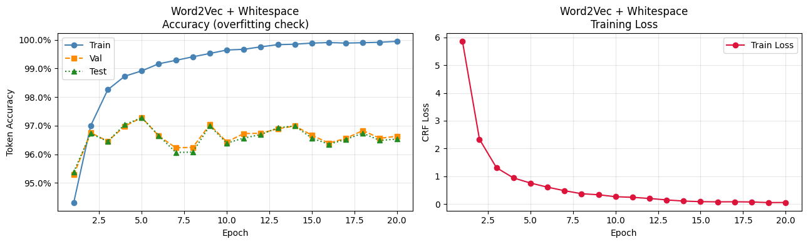

---

## Comparison Charts

### Test Accuracy — All Pipelines

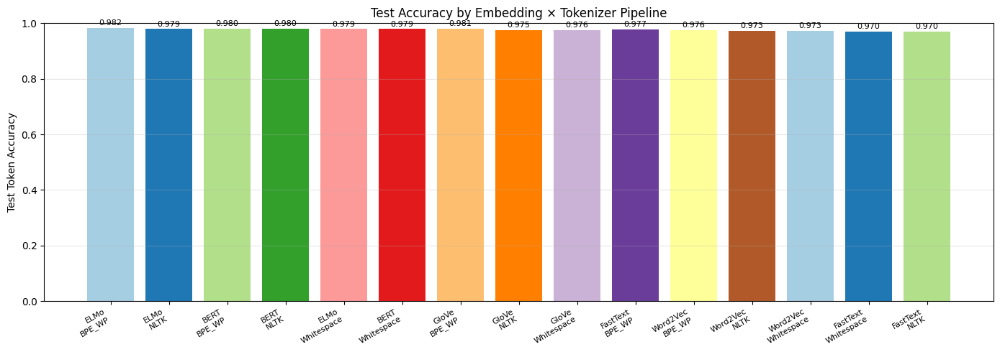

All pipelines achieve high token accuracy (96.9%–98.2%), with contextual embeddings (ELMo, BERT) consistently leading. The accuracy gap across pipelines is narrow (~1.2pp), but F1 score differences are more pronounced.

---

### Test F1 Score — All Pipelines

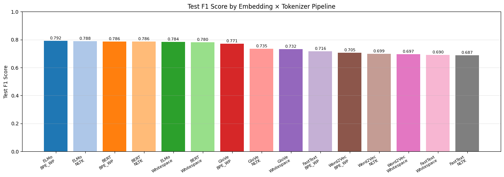

F1 scores reveal clearer separation between embedding tiers. ELMo and BERT dominate (0.78–0.79), GloVe sits in the middle tier (0.73–0.77), and FastText/Word2Vec trail behind (0.69–0.72). BPE_WP tokenization consistently outperforms NLTK and Whitespace within each embedding family.

---

## Key Findings

**1. Contextual embeddings outperform static ones**
ELMo and BERT consistently achieve higher F1 scores (~0.78–0.79) compared to GloVe (~0.73–0.77), FastText and Word2Vec (~0.69–0.72). The ability to generate context-sensitive representations is critical for biomedical NER.

**2. BPE_WP tokenization is the best tokenizer across all embeddings**
In every embedding family, BPE/WordPiece tokenization yields the highest or joint-highest F1. Its subword handling is particularly effective for rare biomedical terms.

**3. BERT achieves the highest Val F1 but ELMo wins on Test F1**
BERT + NLTK leads on validation (0.8072) but ELMo + BPE_WP generalises better to the test set (0.7921 vs 0.7865), suggesting ELMo is more robust on unseen biomedical text.

**4. All models show significant train-val gap (overfitting)**
Training accuracy reaches ~99.9% while val/test plateau at 97–98%. Regularisation strategies (higher dropout, early stopping) could improve generalisation.

**5. Token accuracy is a misleading metric for NER**
High token accuracy (~97–98%) is inflated by the dominance of `O` (non-entity) tags. F1 score on entity spans is the more informative metric, where scores range 0.69–0.79.

---

## Setup & Installation

### Prerequisites

- Python 3.11
- conda (recommended for Apple Silicon / M-series Macs)

### Environment Setup

```bash
# Create conda environment
conda create -n nlp_ner python=3.11
conda activate nlp_ner

# Install core ML packages
conda install -c conda-forge gensim

# Install remaining packages
pip install torch torchvision torchaudio
pip install transformers pytorch-crf seqeval
pip install nltk numpy matplotlib ipywidgets jupyter
pip install tensorflow-macos tensorflow-metal tensorflow-hub  # Apple Silicon only
```

### Dataset

Download BC5CDR via Hugging Face:

```python
from datasets import load_dataset

dataset = load_dataset("tner/bc5cdr")

def save_conll(split, filename):
    with open(filename, 'w') as f:
        for item in dataset[split]:
            for token, tag in zip(item['tokens'], item['tags']):
                f.write(f"{token}\t{tag}\n")
            f.write("\n")

save_conll('train', 'train.txt')
save_conll('validation', 'val.txt')
save_conll('test', 'test.txt')
```

---

## Project Structure

```
Natural_Language_Processing_Multiple_models/
├── README.md
├── requirements.txt
├── ner_pipeline.ipynb          ← Main notebook
├── ner_pipeline_results.csv    ← Full results table
├── train.txt                   ← BC5CDR train split (not committed)
├── val.txt                     ← BC5CDR val split (not committed)
├── test.txt                    ← BC5CDR test split (not committed)
└── .gitignore
```

---

## Dependencies

```
torch>=2.0.0
torchvision>=0.15.0
torchaudio>=2.0.0
transformers>=4.30.0
gensim>=4.3.0
pytorch-crf>=0.7.2
seqeval>=1.2.2
nltk>=3.8.0
numpy>=1.24.0
matplotlib>=3.7.0
ipywidgets>=8.0.0
jupyter>=1.0.0
tensorflow-macos>=2.13.0
tensorflow-hub>=0.14.0
```

---

*BC5CDR dataset: Li et al., 2016. BiLSTM-CRF architecture: Lample et al., 2016.*
